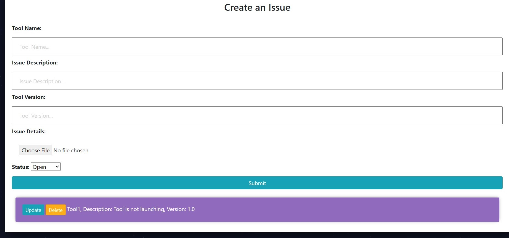

# BugTool
Bug Tracking tool project developed using django.

#### 1. Steps
> 1. Clone the repository
> 2. Run the commands pip install virtualenv, python -m venv venv.
> 3. copy the repository in to venv.
> 4. Run python manage.py runserver.

#### 2. Homepage

