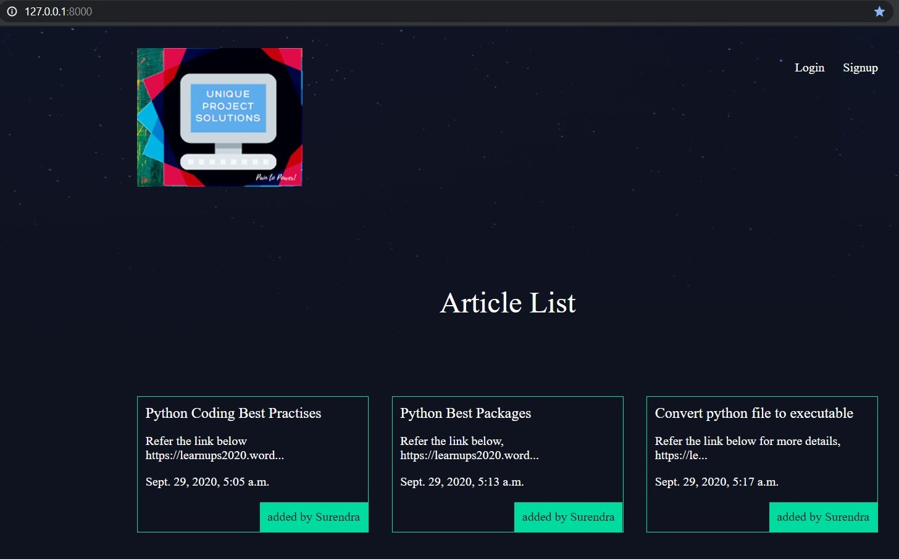

# DjangoProject

This Repository contains the detailed Step by Step Approach of Warehouse Management System Project created using [Python](https://www.python.org/), [Django](https://www.djangoproject.com/).

**This repor is 'work in progress', I'm still writing up regularly for this project. So, stay tuned.**

## Projects

#### 1. Blogpost

#### 2. Bug Tracking Tool

## Steps
#### 1. Setup python & Django in Windows System
<!--- -->

#### 2. Setup python & Django in Linux System
<!--- -->

